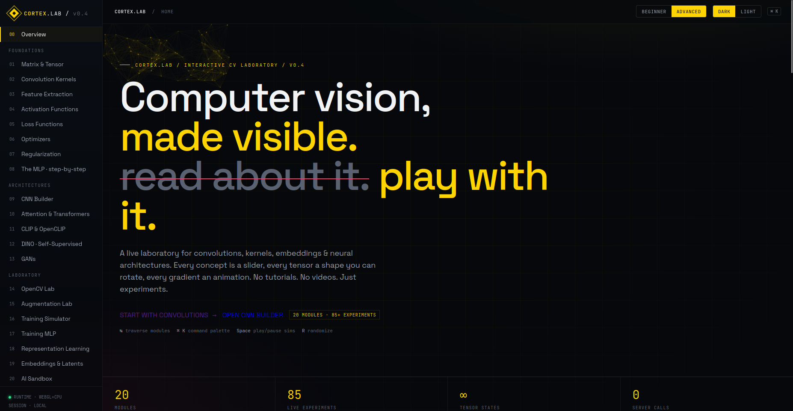

# CORTEX.LAB

An interactive deep learning lab focused on intuition. Each module is a self-contained, visual lesson you can open in the browser with zero setup.

## What You Get
- Visual-first lessons: see signals, weights, and gradients in motion
- MLP step-by-step training with configurable depth, neurons, activation, loss, and optimizer
- Architecture tours: CNNs, attention, CLIP, DINO, GANs
- Lightweight HTML/CSS/JS, no build step

## Quick Start
1. Open `index.html` in your browser.
2. Use the sidebar to jump across modules.
3. Start with the MLP module and tweak layers, neurons, activation, loss, and optimizer.

## Modules
Foundations
- Matrix and tensor basics
- Convolution kernels
- Activations, loss, optimizers, regularization
- MLP step-by-step

Architectures
- CNN builder
- Attention and transformers
- CLIP and DINO
- GANs

Laboratory
- OpenCV lab
- Augmentation lab
- Training simulator
- Training MLP

## Philosophy
Clarity over complexity. Every number is visible and every step is traceable.
